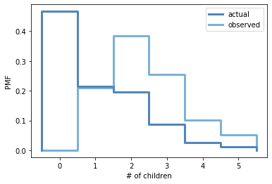

[Think Stats Chapter 3 Exercise 1](http://greenteapress.com/thinkstats2/html/thinkstats2004.html#toc31) (actual vs. biased)

```python
resp = nsfg.ReadFemResp()
```


```python
def BiasPmf(pmf, label):
    new_pmf = pmf.Copy(label=label)

    for x, p in pmf.Items():
        new_pmf.Mult(x, x)
        
    new_pmf.Normalize()
    return new_pmf
```


```python
kid_actual_pmf = thinkstats2.Pmf(resp['numkdhh'], label='actual')
kid_biased_pmf = BiasPmf(kid_actual_pmf, label = 'observed')
```


```python
thinkplot.PrePlot(2)
thinkplot.Pmfs([kid_actual_pmf, kid_biased_pmf])
thinkplot.Config(xlabel='# of children', ylabel='PMF')
```





```python
print('Actual mean', kid_actual_pmf.Mean())
print('Observed mean', kid_biased_pmf.Mean())
```

    Actual mean 1.024205155043831
    Observed mean 2.403679100664282

