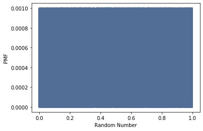
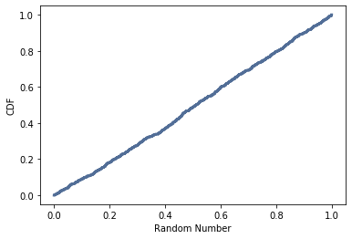

[Think Stats Chapter 4 Exercise 2](http://greenteapress.com/thinkstats2/html/thinkstats2005.html#toc41) (a random distribution)

```python
thousand_random = np.random.random(1000)
```


```python
thousand_pmf = thinkstats2.Pmf(thousand_random)
thinkplot.pmf(thousand_pmf)
thinkplot.Config(xlabel='Random Number', ylabel='PMF')
```





With the PMF, we get a dense, noisy plot. Since we have 1000 #s with equal probabilities of appearing, the probabilities for each are quite tiny (1/1000). 


```python
thousand_cdf = thinkstats2.Cdf(thousand_random)
thinkplot.Cdf(thousand_cdf)
thinkplot.Config(xlabel='Random Number', ylabel='CDF')
```



