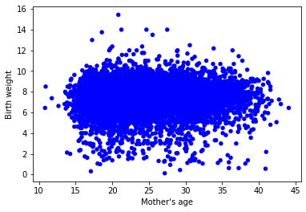
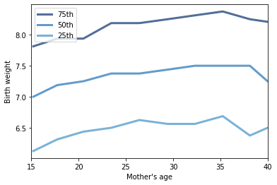

[Think Stats Chapter 7 Exercise 1](http://greenteapress.com/thinkstats2/html/thinkstats2008.html#toc70) (weight vs. age)

```python
thinkplot.Scatter(live['agepreg'], live['totalwgt_lb'], alpha=1)
thinkplot.Config(xlabel="Mother's age",
                 ylabel='Birth weight',
                 legend=False)
```





```python
bins = np.arange(10, 50, 3)
indices = np.digitize(live['agepreg'], bins)
groups = live.groupby(indices)

mean_ages = [group['agepreg'].mean() for i, group in groups][1:-1]
cdfs = [thinkstats2.Cdf(group['totalwgt_lb']) for i, group in groups][1:-1]

for percent in [75, 50, 25]:
    weight_percentiles = [cdf.Percentile(percent) for cdf in cdfs]
    label = '%dth' % percent
    thinkplot.Plot(mean_ages, weight_percentiles, label=label)
    
thinkplot.Config(xlabel="Mother's age",
                 ylabel='Birth weight',
                 xlim=[15, 40], 
                 legend=True)
```





```python
#Pearson
def Corr(xs, ys):
    xs = np.asarray(xs)
    ys = np.asarray(ys)

    meanx, varx = thinkstats2.MeanVar(xs)
    meany, vary = thinkstats2.MeanVar(ys)

    corr = Cov(xs, ys, meanx, meany) / np.sqrt(varx * vary)
    return corr

print('Pearson: {}'.format(Corr(live['agepreg'], live['totalwgt_lb'])))

#Spearman
def SpearmanCorr(xs, ys):
    xs = pd.Series(xs)
    ys = pd.Series(ys)
    return xs.corr(ys, method='spearman')

print('Spearman: {}'.format(SpearmanCorr(live['agepreg'], live['totalwgt_lb'])))
```

    Pearson: 0.06883397035410907
    Spearman: 0.09461004109658226


There appears to be a weak positive correlation between mother's age and birth weight. The scatter plot doesn't display a jarring relationship, and the low correlation coefficients support this. The percentile plot is roughly linear, but near 40 years old, there appears to be some non-linearity. For example, while the 25th percentile's birth weight begins to increase, the 50th percentile's birth weight decreases.
