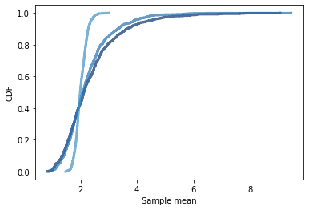

[Think Stats Chapter 8 Exercise 2](http://greenteapress.com/thinkstats2/html/thinkstats2009.html#toc77) (scoring)

```python
def Estimate3(n=7, iters=1000):
    lam = 2
    
    #Computing standard error
    means = []
    for _ in range(iters):
        xs = np.random.exponential(1.0/lam, n)
        L = 1 / np.mean(xs)
        means.append(L)
    
    cdf = thinkstats2.Cdf(means)
    thinkplot.Cdf(cdf)
    thinkplot.Config(xlabel='Sample mean',
                     ylabel='CDF')

    #Standard error
    print('Standard error:', RMSE(means, lam))
    #Confidence intervals
    ci = cdf.Percentile(5), cdf.Percentile(95)
    print('90% Confidence interval:', ci)
    

Estimate3()
Estimate3(10)
Estimate3(100)
```

    Standard error: 1.1136531196842292
    90% Confidence interval: (1.1321765834339883, 4.375511556242647)
    Standard error: 0.8753467548964983
    90% Confidence interval: (1.2465883843174506, 3.8686453252884756)
    Standard error: 0.20625215236965794
    90% Confidence interval: (1.708156251905704, 2.363890726196116)





As N increases, we see 2 things happen:

1. Standard errors decrease
2. Confidence intervals get tighter

Thus, as we increase our sample size, we get closer to the true estimate of lambda.
